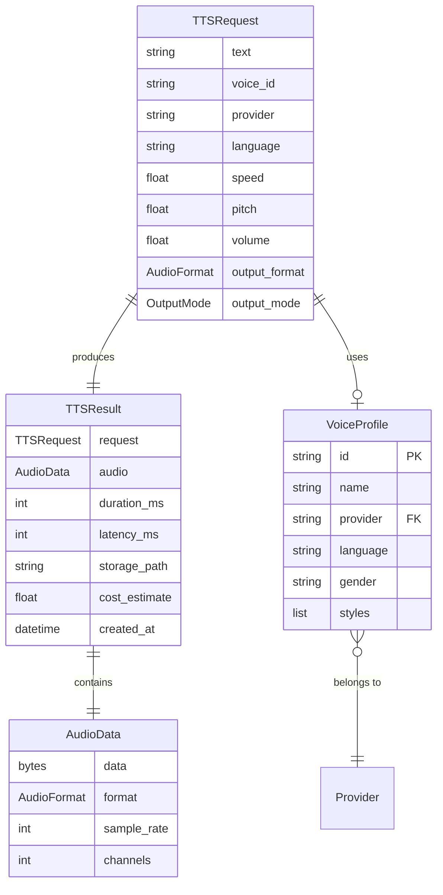
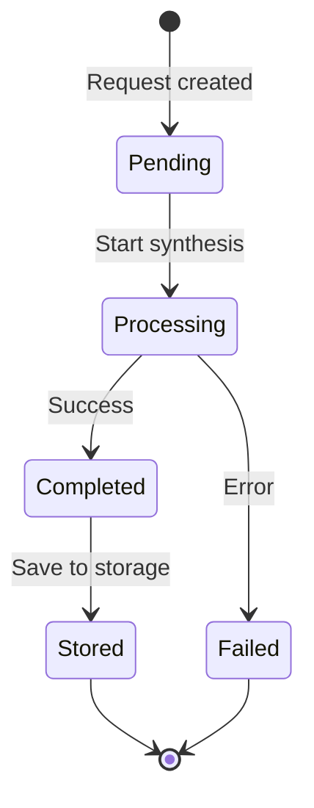

# Data Model: Pipecat TTS Server

**Feature Branch**: `001-pipecat-tts-server`
**Date**: 2026-01-16

## Overview

本文件定義 TTS 伺服器的領域實體（Domain Entities）、值物件（Value Objects）及其關係。所有實體遵循 Clean Architecture 原則，領域層無外部依賴。

---

## Domain Entities

### 1. TTSRequest (Value Object)

代表一次語音合成請求，為不可變值物件（immutable value object）。

```python
@dataclass(frozen=True)
class TTSRequest:
    text: str                          # 必填，輸入文字
    voice_id: str                      # 必填，音色識別碼
    provider: str                      # 必填，TTS 提供者 (azure/gcp/elevenlabs/voai)
    language: str = "zh-TW"            # 語言代碼
    speed: float = 1.0                 # 語速 (0.5 - 2.0)
    pitch: float = 0.0                 # 音調 (-20 to +20 semitones)
    volume: float = 1.0                # 音量 (0.0 - 2.0)
    output_format: AudioFormat = MP3   # 輸出格式
    output_mode: OutputMode = BATCH    # 輸出模式 (batch/streaming)
```

**驗證規則**:

| 欄位 | 規則 | 錯誤訊息 |
|------|------|----------|
| text | 非空, 長度 ≤ 5000 | "Text cannot be empty" / "Text exceeds 5000 characters" |
| voice_id | 非空 | "Voice ID cannot be empty" |
| provider | azure/gcp/elevenlabs/voai | "Invalid provider" |
| speed | 0.5 ≤ x ≤ 2.0 | "Speed must be between 0.5 and 2.0" |
| pitch | -20 ≤ x ≤ 20 | "Pitch must be between -20 and 20" |
| volume | 0.0 ≤ x ≤ 2.0 | "Volume must be between 0.0 and 2.0" |

### 2. TTSResult (Entity)

代表語音合成結果。

```python
@dataclass
class TTSResult:
    request: TTSRequest                # 原始請求
    audio: AudioData                   # 音訊資料
    duration_ms: int                   # 音訊長度（毫秒）
    latency_ms: int                    # 處理延遲（毫秒）
    storage_path: Optional[str]        # 儲存路徑 (storage/{provider}/{uuid}.mp3)
    cost_estimate: float = 0.0         # 預估成本
    metadata: dict[str, Any]           # 額外元資料
    created_at: datetime               # 建立時間
```

**計算屬性**:
- `provider: str` - 從 request 取得提供者名稱
- `voice_id: str` - 從 request 取得音色 ID
- `characters_count: int` - 輸入文字字數

### 3. VoiceProfile (Entity)

代表可用的音色選項。

```python
@dataclass
class VoiceProfile:
    id: str                            # 提供者專屬音色 ID
    name: str                          # 音色名稱
    provider: str                      # 所屬提供者
    language: str                      # 支援語言
    gender: Optional[str]              # 性別 ('male', 'female', 'neutral')
    styles: list[str]                  # 可用風格列表
```

**計算屬性**:
- `unique_id: str` - 全域唯一 ID，格式 `{provider}:{id}`

---

## Value Objects

### AudioFormat (Enum)

支援的音訊格式。

```python
class AudioFormat(Enum):
    MP3 = "mp3"      # audio/mpeg (預設)
    WAV = "wav"      # audio/wav
    OPUS = "opus"    # audio/opus
    WEBM = "webm"    # audio/webm
    OGG = "ogg"      # audio/ogg
    PCM = "pcm"      # audio/pcm
    FLAC = "flac"    # audio/flac
```

**屬性方法**:
- `mime_type: str` - MIME 類型
- `file_extension: str` - 副檔名（含 `.`）

### OutputMode (Enum) - 新增

輸出模式，對應 FR-015/FR-016/FR-017。

```python
class OutputMode(Enum):
    BATCH = "batch"          # 批次合成，完成後返回
    STREAMING = "streaming"  # 串流輸出，邊合成邊返回
```

### AudioData (Value Object)

不可變音訊資料容器。

```python
@dataclass(frozen=True)
class AudioData:
    data: bytes                        # 音訊二進位資料
    format: AudioFormat                # 音訊格式
    sample_rate: int = 24000           # 取樣率 (Hz)
    channels: int = 1                  # 聲道數
```

**計算屬性**:
- `size_bytes: int` - 資料大小（位元組）

---

## Entity Relationships



---

## Provider Interface

統一 TTS 提供者介面（Application Layer Protocol），對應憲章 II. Unified API Abstraction。

```python
class ITTSProvider(ABC):
    # Properties
    name: str                          # 提供者識別碼 (azure/gcp/elevenlabs/voai)
    display_name: str                  # 顯示名稱
    supported_formats: list[AudioFormat]

    # Methods
    async def synthesize(request: TTSRequest) -> TTSResult
    async def synthesize_stream(request: TTSRequest) -> AsyncGenerator[bytes, None]
    async def list_voices(language: str | None) -> list[VoiceProfile]
    async def get_voice(voice_id: str) -> VoiceProfile | None
    def get_supported_params() -> dict
    async def health_check() -> bool
```

---

## Provider Implementations

| Provider | Name | Display Name | Supported Languages | Streaming |
|----------|------|--------------|---------------------|-----------|
| Azure Speech | `azure` | Azure Speech Service | zh-TW, zh-CN, en-US, ja-JP, ko-KR | ✅ |
| Google Cloud TTS | `gcp` | Google Cloud TTS | zh-TW, zh-CN, en-US, ja-JP, ko-KR | ✅ |
| ElevenLabs | `elevenlabs` | ElevenLabs | All (multilingual) | ✅ |
| VoAI | `voai` | VoAI 台灣語音 | zh-TW (主要) | ✅ |

---

## Language Mapping

各提供者語言代碼對應：

| Internal Code | Azure | GCP | ElevenLabs | VoAI |
|---------------|-------|-----|------------|------|
| zh-TW | zh-TW-* | cmn-TW-* | multilingual | zh-TW |
| zh-CN | zh-CN-* | cmn-CN-* | multilingual | zh-CN |
| en-US | en-US-* | en-US-* | multilingual | en-US |
| ja-JP | ja-JP-* | ja-JP-* | multilingual | ja-JP |
| ko-KR | ko-KR-* | ko-KR-* | multilingual | ko-KR |

---

## State Transitions

### TTS Request Lifecycle



---

## Database Schema (PostgreSQL)

### Table: `synthesis_logs`

記錄所有 TTS 請求以供除錯與監控 (FR-010)。

```sql
CREATE TABLE synthesis_logs (
    id UUID PRIMARY KEY DEFAULT gen_random_uuid(),
    text_hash VARCHAR(64) NOT NULL,
    text_preview VARCHAR(100),  -- 前 100 字元
    characters_count INTEGER NOT NULL,
    provider VARCHAR(32) NOT NULL,
    voice_id VARCHAR(128) NOT NULL,
    language VARCHAR(10) NOT NULL,
    speed FLOAT DEFAULT 1.0,
    output_format VARCHAR(10) DEFAULT 'mp3',
    output_mode VARCHAR(16) DEFAULT 'batch',
    storage_path VARCHAR(512),
    duration_ms INTEGER,
    latency_ms INTEGER,
    status VARCHAR(20) NOT NULL,  -- 'pending', 'processing', 'completed', 'failed'
    error_message TEXT,
    cost_estimate DECIMAL(10,6),
    client_ip VARCHAR(50),
    user_id UUID REFERENCES users(id),
    created_at TIMESTAMPTZ DEFAULT NOW(),
    completed_at TIMESTAMPTZ
);

CREATE INDEX idx_synthesis_logs_provider ON synthesis_logs(provider);
CREATE INDEX idx_synthesis_logs_status ON synthesis_logs(status);
CREATE INDEX idx_synthesis_logs_created_at ON synthesis_logs(created_at);
CREATE INDEX idx_synthesis_logs_text_hash ON synthesis_logs(text_hash);
CREATE INDEX idx_synthesis_logs_user_id ON synthesis_logs(user_id);
```

### Table: `voice_cache`

快取可用音色以減少上游 API 呼叫。

```sql
CREATE TABLE voice_cache (
    id VARCHAR(255) PRIMARY KEY,  -- provider:voice_id
    provider VARCHAR(50) NOT NULL,
    voice_id VARCHAR(128) NOT NULL,
    name VARCHAR(255) NOT NULL,
    language VARCHAR(20) NOT NULL,
    gender VARCHAR(20),
    styles JSONB DEFAULT '[]',
    metadata JSONB DEFAULT '{}',
    updated_at TIMESTAMPTZ DEFAULT NOW()
);

CREATE INDEX idx_voice_cache_provider ON voice_cache(provider);
CREATE INDEX idx_voice_cache_language ON voice_cache(language);
```

### Table: `users` (Google SSO)

用戶資料表，對應 FR-020。

```sql
CREATE TABLE users (
    id UUID PRIMARY KEY DEFAULT gen_random_uuid(),
    google_id VARCHAR(128) UNIQUE NOT NULL,
    email VARCHAR(255) UNIQUE NOT NULL,
    name VARCHAR(255),
    picture_url VARCHAR(512),
    created_at TIMESTAMPTZ DEFAULT NOW(),
    last_login_at TIMESTAMPTZ
);

CREATE INDEX idx_users_google_id ON users(google_id);
CREATE INDEX idx_users_email ON users(email);
```
