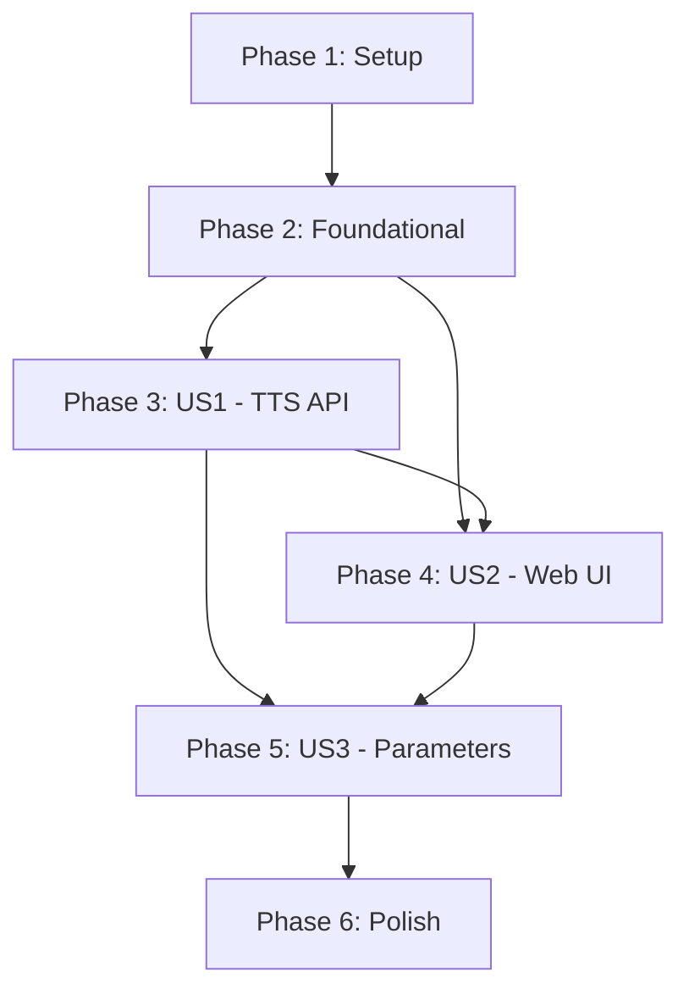

# Tasks: Pipecat TTS Server

**Input**: Design documents from `/docs/features/001-pipecat-tts-server/`
**Prerequisites**: plan.md ✅, spec.md ✅, research.md ✅, data-model.md ✅, contracts/ ✅

**Tests**: Included as per Constitution Principle I (TDD).

**Organization**: Tasks are grouped by user story to enable independent implementation and testing of each story.

## Format: `[ID] [P?] [Story] Description`

- **[P]**: Can run in parallel (different files, no dependencies)
- **[Story]**: Which user story this task belongs to (e.g., US1, US2, US3)
- Include exact file paths in descriptions

## Path Conventions

Based on plan.md structure:
- **Backend**: `backend/src/`
- **Frontend**: `frontend/src/`
- **Tests**: `backend/tests/`

---

## Phase 1: Setup (Shared Infrastructure)

**Purpose**: Project initialization and base environment setup

- [X] T001 Verify backend directory structure per plan.md (`application/`, `domain/`, `infrastructure/`, `presentation/`)
- [X] T002 Verify Python dependencies in `backend/pyproject.toml` include `pipecat-ai[azure,elevenlabs,google]`, `google-auth`
- [X] T003 [P] Verify `ruff` and `mypy` strict mode configuration in `backend/pyproject.toml`
- [X] T004 [P] Verify frontend React + Vite + Tailwind CSS setup in `frontend/`
- [X] T005 [P] Update `.env.example` with VoAI API key placeholder in `backend/.env.example`

---

## Phase 2: Foundational (Blocking Prerequisites)

**Purpose**: Core infrastructure and Authentication MUST be complete before ANY user story

**⚠️ CRITICAL**: No user story work can begin until this phase is complete

### Domain Layer (No External Dependencies)

- [X] T006 [P] Add `OutputMode` enum (BATCH/STREAMING) to `backend/src/domain/entities/audio.py`
- [X] T007 [P] Update `TTSRequest` to include `output_mode` field in `backend/src/domain/entities/tts.py`
- [X] T008 [P] Add text length validation (5000 chars) to `TTSRequest` in `backend/src/domain/entities/tts.py`

### Application Layer (Interfaces & Use Cases)

- [X] T009 [P] Add `synthesize_stream()` method to `ITTSProvider` interface in `backend/src/application/interfaces/tts_provider.py`
- [X] T010 [P] Verify `IStorageService` interface exists in `backend/src/application/interfaces/storage_service.py`

### Infrastructure Layer (Persistence)

- [X] T011 [P] Add `synthesis_logs` table SQLAlchemy model in `backend/src/infrastructure/persistence/models.py`
- [X] T012 [P] Add `voice_cache` table SQLAlchemy model in `backend/src/infrastructure/persistence/models.py`
- [X] T013 [P] Add `users` table SQLAlchemy model for Google SSO in `backend/src/infrastructure/persistence/models.py`
- [X] T014 Create Alembic migration for new tables in `backend/alembic/versions/`

### Authentication (FR-020)

- [X] T015 Implement Google SSO OAuth flow in `backend/src/presentation/api/middleware/auth.py`
- [X] T016 [P] Create auth routes (`/auth/google`, `/auth/callback`, `/auth/me`, `/auth/logout`) in `backend/src/presentation/api/routes/auth.py`
- [X] T017 [P] Create JWT token generation and validation utilities in `backend/src/infrastructure/auth/jwt.py`

### Health & Provider Endpoints

- [X] T018 [P] Add providers listing endpoint (`GET /providers`) in `backend/src/presentation/api/routes/providers.py`
- [X] T019 [P] Add provider health check endpoint (`GET /providers/{provider}/health`) in `backend/src/presentation/api/routes/providers.py`

**Checkpoint**: Foundation ready - Authentication, domain models, and core abstractions are in place

---

## Phase 3: User Story 1 - 文字轉語音基本功能 (Priority: P1) 🎯 MVP

**Goal**: 透過 API 將文字轉換為語音，支援 Azure/GCP/ElevenLabs/VoAI 四個提供者，支援批次與串流模式

**Independent Test**: `curl -X POST /api/v1/tts/synthesize` 返回可播放音訊檔案

### Tests for User Story 1 (TDD) ⚠️

> **NOTE: Write these tests FIRST, ensure they FAIL before implementation**

- [X] T020 [P] [US1] Update contract tests for `/tts/synthesize` endpoint in `backend/tests/contract/test_tts_api.py`
- [X] T021 [P] [US1] Update contract tests for `/tts/stream` endpoint in `backend/tests/contract/test_tts_api.py`
- [X] T022 [P] [US1] Create unit tests for provider adapters in `backend/tests/unit/test_providers.py`
- [X] T023 [P] [US1] Create unit tests for input validation (empty text, text > 5000 chars) in `backend/tests/unit/test_validation.py`

### Implementation for User Story 1

#### TTS Provider Adapters (Pipecat Integration)

- [X] T024 [US1] Complete `AzureTTSProvider` with Pipecat `AzureTTSService` in `backend/src/infrastructure/providers/tts/azure.py`
- [X] T025 [P] [US1] Complete `GoogleTTSProvider` with Pipecat `GoogleTTSService` in `backend/src/infrastructure/providers/tts/google.py`
- [X] T026 [P] [US1] Complete `ElevenLabsTTSProvider` with Pipecat `ElevenLabsTTSService` in `backend/src/infrastructure/providers/tts/elevenlabs.py`
- [X] T027 [P] [US1] Implement custom `VoAITTSProvider` (inheriting from base) in `backend/src/infrastructure/providers/tts/voai.py`

#### Use Case & API Routes

- [X] T028 [US1] Update `SynthesizeSpeechUseCase` to support batch and streaming modes in `backend/src/application/use_cases/synthesize_speech.py`
- [X] T029 [US1] Create `LogSynthesisUseCase` for request logging (FR-010) in `backend/src/application/use_cases/log_synthesis.py`
- [X] T030 [US1] Update TTS API route `POST /tts/synthesize` (batch mode) in `backend/src/presentation/api/routes/tts.py`
- [X] T031 [US1] Add TTS API route `POST /tts/stream` (streaming mode) in `backend/src/presentation/api/routes/tts.py`

#### Storage & Validation

- [X] T032 [US1] Complete local storage implementation (`storage/{provider}/{uuid}.mp3`) in `backend/src/infrastructure/storage/local_storage.py`
- [X] T033 [US1] Update API schemas with proper validation in `backend/src/presentation/api/schemas/tts.py`

#### Error Handling

- [X] T034 [US1] Implement unified error response format in `backend/src/presentation/api/middleware/error_handler.py`
- [X] T035 [US1] Add error codes (VALIDATION_ERROR, TEXT_TOO_LONG, SERVICE_UNAVAILABLE) in `backend/src/domain/errors.py`

**Checkpoint**: US1 Complete - API 可透過四個提供者合成語音（批次/串流），音訊永久儲存

---

## Phase 4: User Story 2 - Web 介面試聽 (Priority: P2)

**Goal**: 透過 Web 介面輸入文字並即時試聽，支援串流播放與波形顯示

**Independent Test**: 在瀏覽器點擊「合成」後音訊即時播放並顯示波形

**Dependencies**: US1 API must be functional

### Tests for User Story 2 (TDD) ⚠️

- [ ] T036 [P] [US2] Create frontend component tests in `frontend/src/components/tts/__tests__/`
- [ ] T037 [P] [US2] Create integration test for synthesis flow in `backend/tests/integration/test_web_flow.py`

### Implementation for User Story 2

#### Frontend API Client

- [X] T038 [US2] Update API client with TTS endpoints in `frontend/src/lib/api.ts`
- [X] T039 [US2] Add streaming fetch support (ReadableStream) in `frontend/src/lib/streaming.ts`

#### TTS Components

- [X] T040 [US2] Create `TextInput` component (textarea with char counter) in `frontend/src/components/tts/TextInput.tsx`
- [X] T041 [P] [US2] Create `ProviderSelector` component (dropdown for Azure/GCP/ElevenLabs/VoAI) in `frontend/src/components/tts/ProviderSelector.tsx`
- [X] T042 [P] [US2] Create `AudioPlayer` component with play/pause/download in `frontend/src/components/tts/AudioPlayer.tsx`
- [ ] T043 [US2] Install and integrate WaveSurfer.js for waveform visualization
- [ ] T044 [US2] Create `WaveformDisplay` component using WaveSurfer.js in `frontend/src/components/tts/WaveformDisplay.tsx`
- [X] T045 [US2] Create `LoadingIndicator` component for synthesis in progress in `frontend/src/components/tts/LoadingIndicator.tsx`

#### Authentication Components

- [X] T046 [US2] Create `LoginButton` component (Google SSO) in `frontend/src/components/auth/LoginButton.tsx`
- [X] T047 [P] [US2] Create `UserMenu` component (profile, logout) in `frontend/src/components/auth/UserMenu.tsx`
- [X] T048 [US2] Create auth state store (Zustand) in `frontend/src/stores/authStore.ts`

#### Page Integration

- [X] T049 [US2] Update `TTSPage` with all TTS components in `frontend/src/routes/tts/TTSPage.tsx`
- [ ] T050 [US2] Add protected route wrapper requiring authentication in `frontend/src/components/auth/ProtectedRoute.tsx`
- [ ] T051 [US2] Update `App.tsx` routing with auth flow

**Checkpoint**: US2 Complete - Web UI 可輸入文字、選擇提供者、即時串流播放並顯示波形

---

## Phase 5: User Story 3 - 語音參數調整 (Priority: P3)

**Goal**: 調整語速、音調、音色等參數，支援多語言選擇

**Independent Test**: 調整語速為 2.0x 後，合成音訊速度明顯加快

**Dependencies**: US1 API and US2 UI should be functional

### Tests for User Story 3 (TDD) ⚠️

- [ ] T052 [P] [US3] Create unit tests for parameter validation in `backend/tests/unit/test_params.py`
- [ ] T053 [P] [US3] Create tests for voice listing endpoint in `backend/tests/contract/test_voices_api.py`

### Implementation for User Story 3

#### Backend - Voice & Parameters

- [ ] T054 [US3] Implement `ListVoicesUseCase` in `backend/src/application/use_cases/list_voices.py`
- [ ] T055 [US3] Add `GET /voices` endpoint (list all voices with filters) in `backend/src/presentation/api/routes/voices.py`
- [ ] T056 [P] [US3] Add `GET /voices/{provider}/{voice_id}` endpoint in `backend/src/presentation/api/routes/voices.py`
- [ ] T057 [US3] Implement parameter mapping per provider (speed, pitch ranges) in adapters

#### Frontend - Parameter Controls

- [ ] T058 [US3] Create `SpeedSlider` component (0.5x - 2.0x) in `frontend/src/components/tts/SpeedSlider.tsx`
- [ ] T059 [P] [US3] Create `PitchSlider` component (-20 to +20) in `frontend/src/components/tts/PitchSlider.tsx`
- [ ] T060 [P] [US3] Create `VolumeSlider` component (0 - 2.0x) in `frontend/src/components/tts/VolumeSlider.tsx`
- [ ] T061 [US3] Create `VoiceSelector` component (dynamic voice list from API) in `frontend/src/components/tts/VoiceSelector.tsx`
- [ ] T062 [P] [US3] Create `LanguageSelector` component (zh-TW, zh-CN, en-US, ja-JP, ko-KR) in `frontend/src/components/tts/LanguageSelector.tsx`

#### Page Integration

- [ ] T063 [US3] Update `TTSPage` to include all parameter controls in `frontend/src/routes/tts/TTSPage.tsx`
- [ ] T064 [US3] Create TTS state store with parameters (Zustand) in `frontend/src/stores/ttsStore.ts`

**Checkpoint**: US3 Complete - 完整參數控制（語速、音調、音量、音色、語言）可用於 API 與 UI

---

## Phase 6: Polish & Cross-Cutting Concerns

**Purpose**: Performance, edge cases, and final verification

### Performance & Monitoring

- [ ] T065 [P] Implement TTFB (Time to First Byte) measurement in synthesis logging
- [ ] T066 [P] Add performance benchmarks in `backend/tests/benchmark/test_synthesis_perf.py`
- [ ] T067 [P] Implement rate limiting middleware in `backend/src/presentation/api/middleware/rate_limit.py`

### Edge Cases (from spec.md)

- [ ] T068 [P] Handle TTS provider unavailability with retry suggestion in error response
- [ ] T069 [P] Handle special characters and emojis in input text
- [ ] T070 [P] Handle concurrent request processing

### Documentation & Cleanup

- [ ] T071 [P] Update API documentation with all new endpoints
- [ ] T072 Run cross-browser verification (Chrome, Firefox, Safari, Edge)
- [ ] T073 Final `quickstart.md` validation and cleanup
- [ ] T074 Update `README.md` with feature description

---

## Dependencies & Execution Order

### Phase Dependencies

### User Story Dependencies

| Story | Depends On | Can Parallelize With |
|-------|------------|----------------------|
| US1 (P1) | Phase 2 (Foundational) | - |
| US2 (P2) | Phase 2, US1 API | US1 (partial overlap possible) |
| US3 (P3) | Phase 2, US1 API, US2 UI | - |

### Parallel Opportunities Per Phase

**Phase 2 (Foundational)**:
- T006, T007, T008 (domain layer - different files)
- T011, T012, T013 (persistence models - same file but additive)
- T016, T17 (auth components - different files)
- T018, T019 (provider endpoints - different routes)

**Phase 3 (US1)**:
- T020, T021, T022, T023 (tests - different files)
- T024, T025, T026, T027 (provider adapters - different files)

**Phase 4 (US2)**:
- T040, T041, T042 (components - different files)
- T046, T047 (auth components - different files)

**Phase 5 (US3)**:
- T058, T059, T060, T062 (slider/selector components - different files)

---

## Implementation Strategy

### MVP First (User Story 1 Only)

1. Complete Phase 1: Setup (verification)
2. Complete Phase 2: Foundational (CRITICAL - blocks all stories)
3. Complete Phase 3: User Story 1 (TTS API)
4. **STOP and VALIDATE**: Test API independently via cURL
5. Deploy/demo if ready

### Incremental Delivery

1. Setup + Foundational → Foundation ready
2. Add User Story 1 → Test API → Deploy/Demo (MVP!)
3. Add User Story 2 → Test Web UI → Deploy/Demo
4. Add User Story 3 → Test Parameters → Deploy/Demo
5. Polish → Final release

### Parallel Team Strategy

With multiple developers:

1. Team completes Setup + Foundational together
2. Once Foundational is done:
   - Developer A: User Story 1 (Backend API)
   - Developer B: User Story 2 (Frontend, once US1 API is partially ready)
3. Developer A or B: User Story 3 (After US1+US2 stable)
4. All: Polish phase

---

## Task Summary

| Phase | Task Count | User Story | Status |
|-------|------------|------------|--------|
| Phase 1: Setup | 5 | - | Verification |
| Phase 2: Foundational | 14 | - | Blocking |
| Phase 3: US1 | 16 | P1 - TTS API | MVP |
| Phase 4: US2 | 16 | P2 - Web UI | Enhancement |
| Phase 5: US3 | 13 | P3 - Parameters | Enhancement |
| Phase 6: Polish | 10 | - | Final |
| **Total** | **74** | | |

---

## Notes

- [P] tasks = different files, no dependencies
- [Story] label maps task to specific user story for traceability
- Each user story should be independently completable and testable
- Verify tests fail before implementing
- Commit after each task or logical group
- Stop at any checkpoint to validate story independently
- Avoid: vague tasks, same file conflicts, cross-story dependencies that break independence
