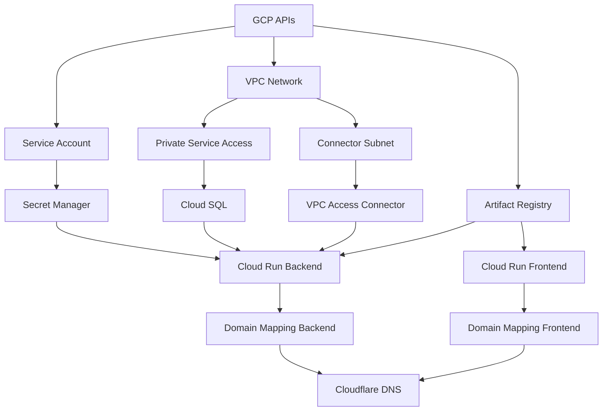

# Data Model: GCP Terraform Deploy

**Feature**: 006-gcp-terraform-deploy
**Date**: 2026-01-20

本文件描述 Terraform 資源模型，定義所有需要建立的 GCP 基礎設施資源及其關係。

---

## Resource Overview

```
┌─────────────────────────────────────────────────────────────────────┐
│                           GCP Project                                │
│  ┌──────────────────────────────────────────────────────────────┐  │
│  │                         VPC Network                           │  │
│  │  ┌─────────────────┐  ┌─────────────────────────────────┐   │  │
│  │  │   Connector     │  │     Private Service Access       │   │  │
│  │  │   Subnet /28    │  │         (VPC Peering)            │   │  │
│  │  └────────┬────────┘  └──────────────┬──────────────────┘   │  │
│  │           │                          │                       │  │
│  │  ┌────────▼────────┐       ┌────────▼────────┐              │  │
│  │  │   Serverless    │       │    Cloud SQL    │              │  │
│  │  │   VPC Access    │       │   PostgreSQL    │              │  │
│  │  │   Connector     │       │   (Private IP)  │              │  │
│  │  └────────┬────────┘       └─────────────────┘              │  │
│  └───────────┼──────────────────────────────────────────────────┘  │
│              │                                                      │
│  ┌───────────▼──────────────────────────────────────────────────┐  │
│  │                      Cloud Run Services                       │  │
│  │  ┌─────────────────────┐  ┌─────────────────────┐           │  │
│  │  │  Backend Service    │  │  Frontend Service   │           │  │
│  │  │  (FastAPI)          │  │  (React + Nginx)    │           │  │
│  │  └─────────────────────┘  └─────────────────────┘           │  │
│  └───────────────────────────────────────────────────────────────┘  │
│                                                                      │
│  ┌─────────────────┐  ┌─────────────────┐  ┌─────────────────┐    │
│  │ Secret Manager  │  │ Cloud Storage   │  │ Artifact        │    │
│  │ (API Keys, DB)  │  │ (TF State,      │  │ Registry        │    │
│  │                 │  │  Audio Files)   │  │ (Container      │    │
│  └─────────────────┘  └─────────────────┘  │  Images)        │    │
│                                             └─────────────────┘    │
└─────────────────────────────────────────────────────────────────────┘
                                │
                                │ DNS (CNAME)
                                ▼
                    ┌─────────────────────┐
                    │     Cloudflare      │
                    │   (DNS Only Mode)   │
                    └─────────────────────┘
```

---

## 1. Project & APIs

### google_project_service

啟用必要的 GCP APIs。

| Service | Description |
|---------|-------------|
| `run.googleapis.com` | Cloud Run API |
| `sqladmin.googleapis.com` | Cloud SQL Admin API |
| `secretmanager.googleapis.com` | Secret Manager API |
| `compute.googleapis.com` | Compute Engine API (VPC) |
| `servicenetworking.googleapis.com` | Service Networking API |
| `artifactregistry.googleapis.com` | Artifact Registry API |
| `iam.googleapis.com` | IAM API |

---

## 2. Networking Resources

### google_compute_network

| Attribute | Value | Description |
|-----------|-------|-------------|
| name | `voice-lab-vpc` | VPC 網路名稱 |
| auto_create_subnetworks | `false` | 手動建立子網路 |

### google_compute_subnetwork (Connector)

| Attribute | Value | Description |
|-----------|-------|-------------|
| name | `voice-lab-connector-subnet` | Serverless Connector 子網路 |
| ip_cidr_range | `10.8.0.0/28` | 必須為 /28 |
| region | `asia-east1` | 區域 |

### google_vpc_access_connector

| Attribute | Value | Description |
|-----------|-------|-------------|
| name | `voice-lab-connector` | VPC Access Connector |
| region | `asia-east1` | 區域 |
| ip_cidr_range | `10.8.0.0/28` | 與子網路相同 |
| min_throughput | `200` | 最小吞吐量 |
| max_throughput | `1000` | 最大吞吐量 |

### google_compute_global_address (Private Service Access)

| Attribute | Value | Description |
|-----------|-------|-------------|
| name | `voice-lab-private-ip` | 私有 IP 範圍 |
| purpose | `VPC_PEERING` | VPC Peering 用途 |
| address_type | `INTERNAL` | 內部地址 |
| prefix_length | `16` | CIDR 前綴 |

### google_service_networking_connection

| Attribute | Value | Description |
|-----------|-------|-------------|
| network | `voice-lab-vpc` | 連接的 VPC |
| service | `servicenetworking.googleapis.com` | 服務網路 |
| reserved_peering_ranges | `[voice-lab-private-ip]` | 保留的 IP 範圍 |

---

## 3. Cloud SQL Resources

### google_sql_database_instance

| Attribute | Value | Description |
|-----------|-------|-------------|
| name | `voice-lab-postgres` | 實例名稱 |
| database_version | `POSTGRES_16` | PostgreSQL 版本 |
| region | `asia-east1` | 區域 |
| deletion_protection | `true` (prod) / `false` (test) | 刪除保護 |
| **settings.tier** | `db-f1-micro` | 最小規格 |
| settings.ip_configuration.ipv4_enabled | `false` | 停用公開 IP |
| settings.ip_configuration.private_network | `voice-lab-vpc` | 私有 VPC |

### google_sql_database

| Attribute | Value | Description |
|-----------|-------|-------------|
| name | `voicelab` | 資料庫名稱 |
| instance | `voice-lab-postgres` | 所屬實例 |

### google_sql_user

| Attribute | Value | Description |
|-----------|-------|-------------|
| name | `voicelab` | 使用者名稱 |
| instance | `voice-lab-postgres` | 所屬實例 |
| password | `(from Secret Manager)` | 密碼 (動態生成) |

---

## 4. Secret Manager Resources

### google_secret_manager_secret

| Secret ID | Description | Lifecycle |
|-----------|-------------|-----------|
| `db-password` | Cloud SQL 密碼 | 自動生成，部署時建立 |
| `oauth-client-id` | Google OAuth Client ID | 手動設定 |
| `oauth-client-secret` | Google OAuth Client Secret | 手動設定 |
| `openai-api-key` | OpenAI API Key | 手動設定 |
| `azure-speech-key` | Azure Speech Key | 手動設定 (Optional) |
| `google-tts-credentials` | Google TTS Service Account | 手動設定 (Optional) |
| `elevenlabs-api-key` | ElevenLabs API Key | 手動設定 (Optional) |

### google_secret_manager_secret_iam_member

授權 Cloud Run 服務帳號存取 secrets。

| Role | Principal |
|------|-----------|
| `roles/secretmanager.secretAccessor` | `serviceAccount:voice-lab-cloudrun-sa@{project}.iam.gserviceaccount.com` |

---

## 5. IAM Resources

### google_service_account

| Attribute | Value | Description |
|-----------|-------|-------------|
| account_id | `voice-lab-cloudrun-sa` | 服務帳號 ID |
| display_name | `Voice Lab Cloud Run Service Account` | 顯示名稱 |

### google_project_iam_member

| Role | Description |
|------|-------------|
| `roles/cloudsql.client` | 連接 Cloud SQL |
| `roles/logging.logWriter` | 寫入 Cloud Logging |
| `roles/storage.objectViewer` | 讀取 Cloud Storage |

---

## 6. Cloud Run Resources

### google_cloud_run_v2_service (Backend)

| Attribute | Value | Description |
|-----------|-------|-------------|
| name | `voice-lab-backend` | 服務名稱 |
| location | `asia-east1` | 區域 |
| template.containers.image | `asia-east1-docker.pkg.dev/{project}/voice-lab/backend:latest` | 容器映像 |
| template.containers.resources.limits.cpu | `1` | CPU 限制 |
| template.containers.resources.limits.memory | `512Mi` | 記憶體限制 |
| template.scaling.min_instance_count | `0` | 最小實例 (閒置零成本) |
| template.scaling.max_instance_count | `10` | 最大實例 |
| template.vpc_access.connector | `voice-lab-connector` | VPC Connector |
| template.vpc_access.egress | `PRIVATE_RANGES_ONLY` | 私有流量走 VPC |
| template.service_account | `voice-lab-cloudrun-sa` | 服務帳號 |

#### Environment Variables

| Name | Source | Description |
|------|--------|-------------|
| `DATABASE_HOST` | Terraform output | Cloud SQL Private IP |
| `DATABASE_PORT` | Static | `5432` |
| `DATABASE_NAME` | Terraform output | `voicelab` |
| `DATABASE_USER` | Terraform output | `voicelab` |
| `DATABASE_PASSWORD` | Secret Manager | `db-password` |
| `ALLOWED_DOMAINS` | Variable | `heyuai.com.tw` |
| `OAUTH_CLIENT_ID` | Secret Manager | `oauth-client-id` |
| `OAUTH_CLIENT_SECRET` | Secret Manager | `oauth-client-secret` |
| `OPENAI_API_KEY` | Secret Manager | `openai-api-key` |

### google_cloud_run_v2_service (Frontend)

| Attribute | Value | Description |
|-----------|-------|-------------|
| name | `voice-lab-frontend` | 服務名稱 |
| location | `asia-east1` | 區域 |
| template.containers.image | `asia-east1-docker.pkg.dev/{project}/voice-lab/frontend:latest` | 容器映像 |
| template.containers.resources.limits.cpu | `1` | CPU 限制 |
| template.containers.resources.limits.memory | `256Mi` | 記憶體限制 |
| template.scaling.min_instance_count | `0` | 最小實例 |
| template.scaling.max_instance_count | `5` | 最大實例 |

#### Environment Variables

| Name | Source | Description |
|------|--------|-------------|
| `VITE_API_URL` | Terraform output | Backend API URL |
| `VITE_OAUTH_CLIENT_ID` | Variable | Google OAuth Client ID (公開) |

### google_cloud_run_service_iam_member

| Service | Role | Member |
|---------|------|--------|
| backend | `roles/run.invoker` | `allUsers` (公開 API) |
| frontend | `roles/run.invoker` | `allUsers` (公開網站) |

### google_cloud_run_domain_mapping

| Attribute | Value (Backend) | Value (Frontend) |
|-----------|-----------------|------------------|
| name | `api.voice-lab.heyuai.com.tw` | `voice-lab.heyuai.com.tw` |
| location | `asia-east1` | `asia-east1` |
| spec.route_name | `voice-lab-backend` | `voice-lab-frontend` |

---

## 7. Cloud Storage Resources

### google_storage_bucket (Terraform State)

| Attribute | Value | Description |
|-----------|-------|-------------|
| name | `voice-lab-tf-state` | Bucket 名稱 (全域唯一) |
| location | `ASIA` | 多區域位置 |
| versioning.enabled | `true` | 啟用版本控制 |
| uniform_bucket_level_access | `true` | 統一存取控制 |

### google_storage_bucket (Audio Files)

| Attribute | Value | Description |
|-----------|-------|-------------|
| name | `voice-lab-audio-storage` | Bucket 名稱 |
| location | `ASIA-EAST1` | 單區域位置 |
| storage_class | `STANDARD` | 標準儲存類別 |

---

## 8. Artifact Registry Resources

### google_artifact_registry_repository

| Attribute | Value | Description |
|-----------|-------|-------------|
| repository_id | `voice-lab` | Repository ID |
| location | `asia-east1` | 區域 |
| format | `DOCKER` | Docker 格式 |

---

## 9. Cloudflare Resources (External)

### cloudflare_record (Backend API)

| Attribute | Value | Description |
|-----------|-------|-------------|
| zone_id | `{cloudflare_zone_id}` | Zone ID |
| name | `api.voice-lab` | 子網域 |
| type | `CNAME` | 記錄類型 |
| value | `ghs.googleusercontent.com` | Cloud Run CNAME 目標 |
| proxied | `false` | DNS Only 模式 |

### cloudflare_record (Frontend)

| Attribute | Value | Description |
|-----------|-------|-------------|
| zone_id | `{cloudflare_zone_id}` | Zone ID |
| name | `voice-lab` | 子網域 |
| type | `CNAME` | 記錄類型 |
| value | `ghs.googleusercontent.com` | Cloud Run CNAME 目標 |
| proxied | `false` | DNS Only 模式 |

---

## Resource Dependencies



---

## Terraform State Structure

```hcl
# terraform.tfstate 中的資源路徑
module.apis.google_project_service.required_apis["run.googleapis.com"]
module.networking.google_compute_network.vpc
module.networking.google_compute_subnetwork.connector
module.networking.google_vpc_access_connector.main
module.networking.google_service_networking_connection.private_vpc
module.cloud_sql.google_sql_database_instance.main
module.cloud_sql.google_sql_database.main
module.cloud_sql.google_sql_user.main
module.secrets.google_secret_manager_secret.secrets["db-password"]
module.iam.google_service_account.cloud_run
module.cloud_run.google_cloud_run_v2_service.backend
module.cloud_run.google_cloud_run_v2_service.frontend
module.cloud_run.google_cloud_run_domain_mapping.backend
module.cloud_run.google_cloud_run_domain_mapping.frontend
module.storage.google_storage_bucket.audio
```
